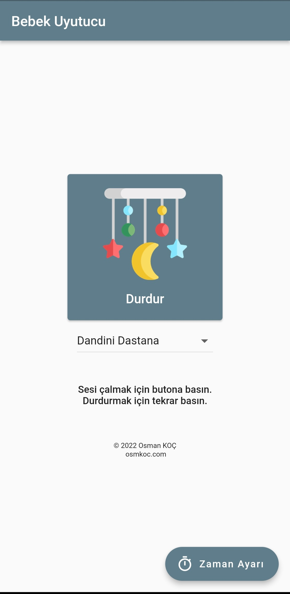
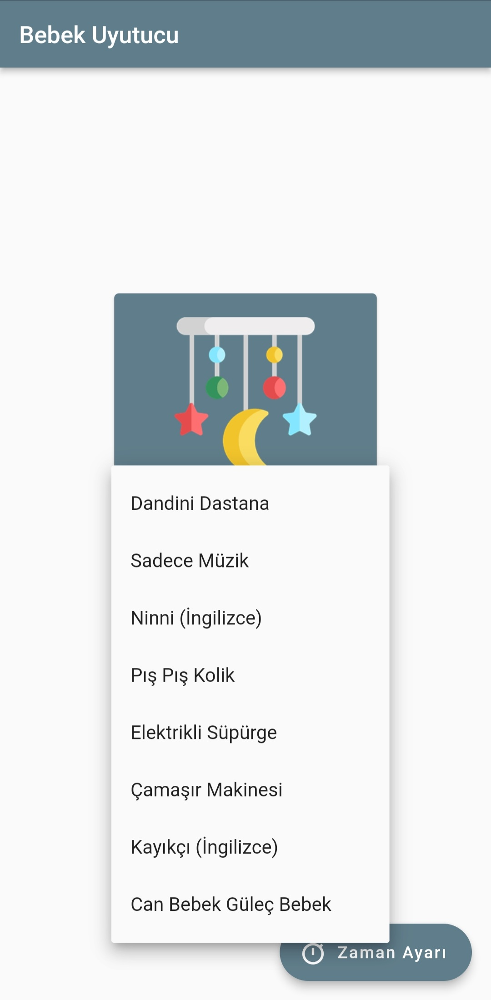
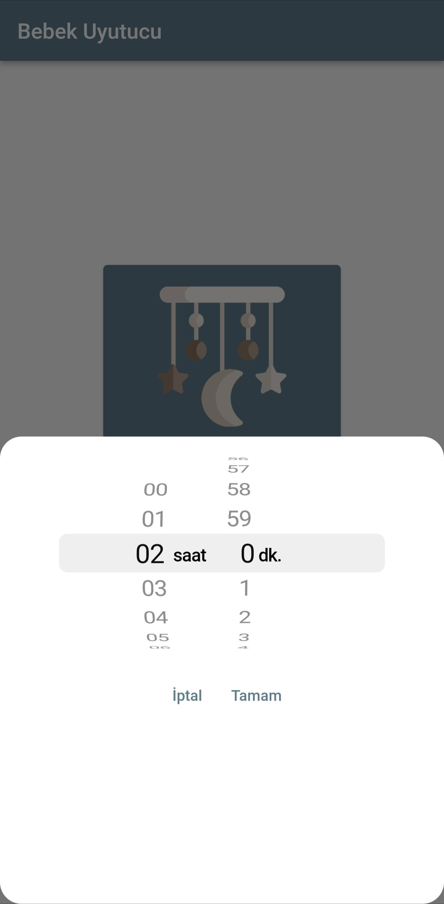
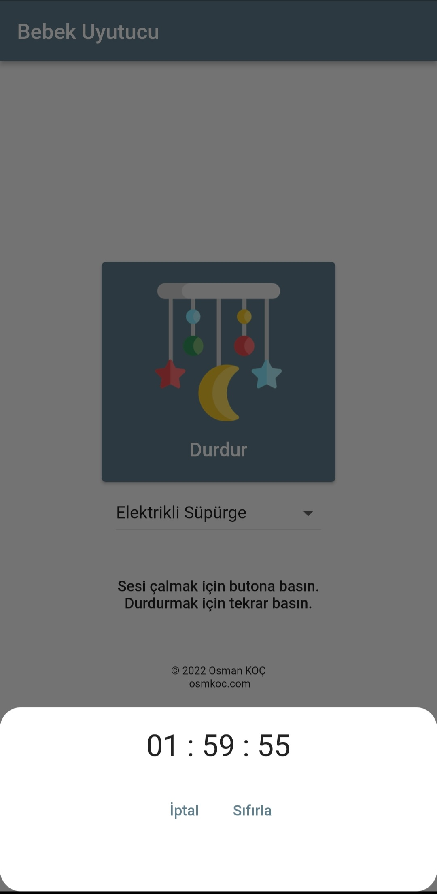
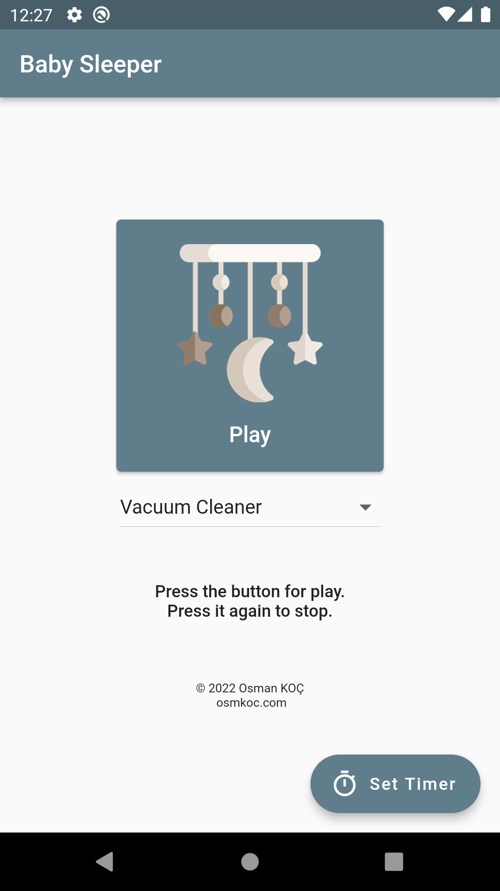
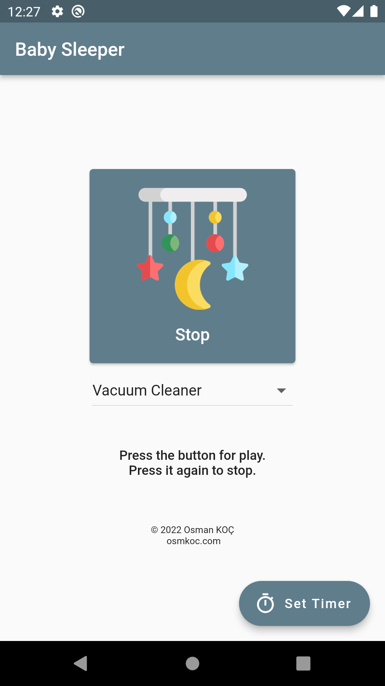
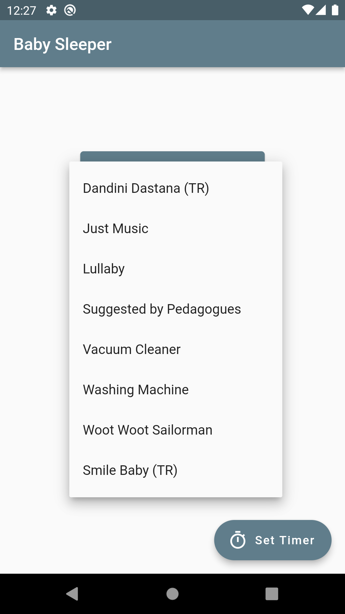
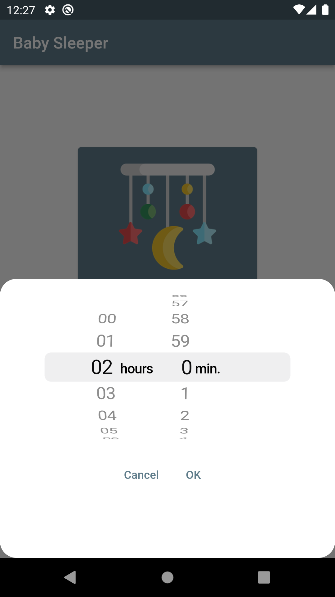
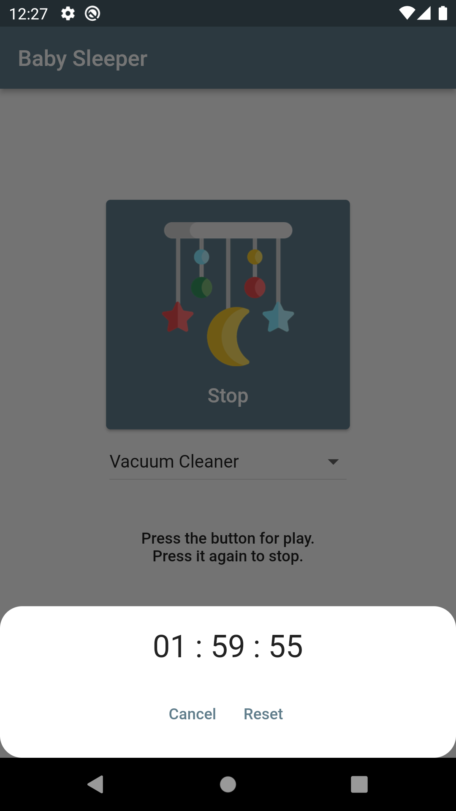

# Baby Sleeper

It is a mobile application developed with Flutter. It helps the baby to sleep. Without pausing, sounds will play to put the baby to sleep.

## Mobile App Description
### EN
You can find music suitable for all ages, recommended by pedagogues, in this application. And you don't need internet! After you start the music, it plays in an endless loop until you stop it. But if you want, you can set the time based on hours and minutes. It will stop automatically after the set time. It rings even when the phone screen is turned off, so you don't run out of battery. The application has Turkish and English language support. It is automatically adjusted according to the language of your phone.
### TR
Bu uygulama ile bebeklerinizi uyutacağınız müzikleri internete ihtiyaç duymadan dinletebilirsiniz. Her yaş bebeğe uygun olarak ninniler, müzikler, çamaşır makinesi ve elektrikli süpürge sesi gibi çeşitli sesleri sonsuz döngüde dinletebilirsiniz. İsterseniz zaman ayarı sayesinde saat ve dakika bazlı ayarlayabilirsiniz. Böylece süre tamamlandığında otomatik olarak müzik duracaktır. Ayrıca müziği başlattıktan sonra telefon ekranını açık bırakmak zorunda değilsiniz, ekran kapalıyken de çalar. Uygulamada Türkçe ve İngilizce dil desteği bulunmaktadır. Telefonunuzun diline göre otomatik olarak ayarlanmaktadır.

## Screenshot
### EN

  
  
  
  
  

### TR

  
  
  
  
  

